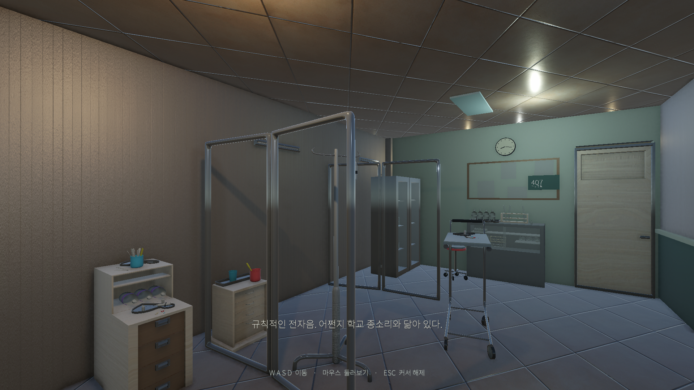
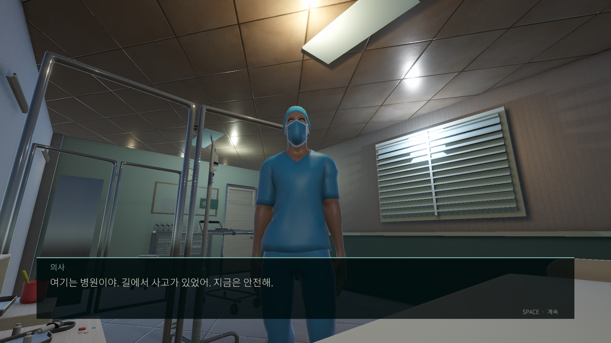
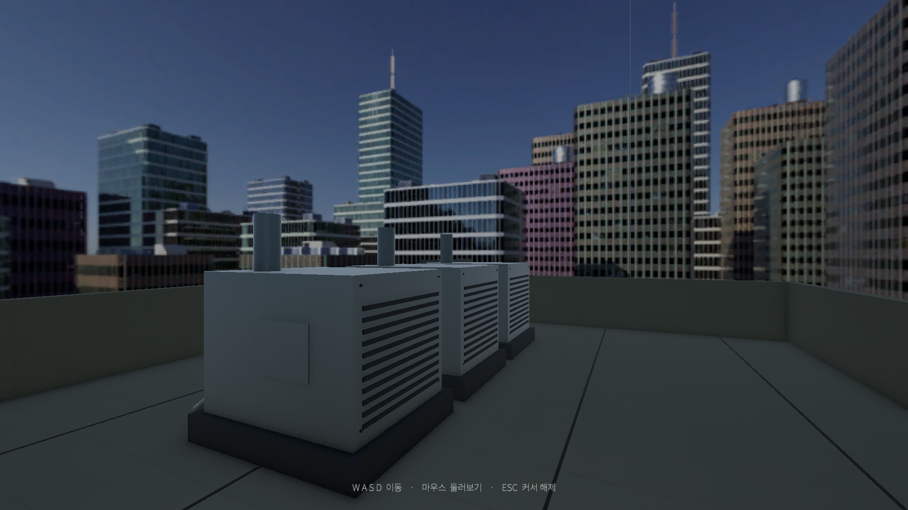

# 결석 · Unity 심리 공포 게임

1인칭 병원 탐색과 대화, 단서 조사, 분기 진행을 구현 중인 프로젝트입니다. 노션의 초기 기획과 로컬의 현재 구현을 구분해 정리했습니다.

## 구현된 Day0
병실 도입 → 자유 탐색 → 의사·간호사·보호자 대화 → 시설관리 단서와 패널 → 계단 → 옥상 게이트와 이벤트가 연결되어 있습니다. 로컬 작업 문서에는 복도 이동, 대화, 패널 입력, 옥상 경로 자동 검사 통과가 기록되어 있습니다. 이번 정리에서 Unity를 다시 실행한 결과는 아닙니다.

## 공개 범위와 재현
`Scripts/`는 현재 게임 로직의 소스 스냅샷입니다. 씬·프리팹·외부 아트 자산 전체를 포함하지 않으므로 **이 폴더만으로 게임을 빌드할 수는 없습니다**. 전체 실행 프로젝트는 원본 로컬 Unity 프로젝트에서 관리합니다.

## 진행 중
Day1 연결, 최종 NPC 모델과 음성, QTE 연출, 옥상 루트의 최종 엔딩은 남아 있습니다. 초기 기획의 6개 엔딩이 전부 완성된 것으로 표시하지 않습니다.

[초기 노션 기획](https://app.notion.com/p/2101b45f6f0780e7ad8de571e91df691)
