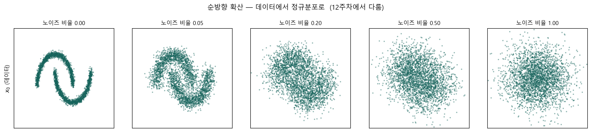

# 🧭 00 · 과목의 큰 그림과 첫 실습 — 데이터에 노이즈를 더하면

[딥러닝 심화](https://app.notion.com/p/3ce1b45f6f0780b9a1e7cb8dda9e1d27)
**자료 범위**: Deep2 0~2강과 실습 노트북.
**그림 기준**: 원본 이미지 또는 노트북에 저장된 실행 출력입니다. 이번 정리에서 전체 학습을 재실행한 결과는 아닙니다.

**원본**: 0강. 딥러닝 심화 과목 소개.ipynb · 0강 실습문제 정답.ipynb
## 기초에서 무엇이 확장되는가
기초에서는 입력을 예측으로 바꾸고 손실을 줄이는 법을 배웠습니다. 심화는 **순서가 있는 데이터의 규칙을 배우는 일**과 **데이터의 분포를 배워 새 표본을 만드는 일**로 확장됩니다. 문자 모델은 다음 문자 분포를 배우고 그 분포에서 문자를 꺼내므로 두 주제를 연결하는 예입니다.
분류용 정답 라벨이 없어도 학습 신호는 만들 수 있습니다. 언어 모델은 다음 문자, 노이즈 예측 모델은 실제로 더한 노이즈를 목표로 삼습니다.
## 확보된 자료와 이후 학습
0강은 환경과 전체 방향, 1강은 표현·확률분포·학습 목표, 2강은 순차 데이터·RNN·LSTM·GRU와 한글 수사 실습입니다. Attention·Transformer·VAE·GAN·Diffusion·Flow Matching은 원본의 후속 학습 안내에 해당합니다. 여기서는 연결만 소개하며 상세 강의나 과제 수행 완료로 표시하지 않습니다.
## 첫 실습을 수식으로 읽기
$$
x_s=\sqrt{1-s}\,x_0+\sqrt{s}\,\epsilon,\qquad \epsilon\sim\mathcal N(0,I),\quad 0\le s\le1
$$
x₀는 원래 데이터, ε은 표준정규 잡음, s는 잡음의 비율입니다. s=0이면 x₀이고, s=1이면 ε만 남습니다. s=0.5에서는 원본과 잡음에 각각 약 0.707을 곱합니다. 단순히 절반씩 더하는 식이 아닙니다.
독립이고 각 좌표의 분산이 1이면 두 항의 분산 기여가 (1−s)+(s)=1이 됩니다. 원본의 분산이 1이 아니면 모든 중간 단계의 분산이 자동으로 1인 것은 아닙니다.

**그림 읽기**: 왼쪽에서 오른쪽으로 잡음 비율이 커집니다. 초승달 사이의 빈 공간과 곡선 구조가 흐려지고 마지막에는 원래 모양을 구별하기 어렵습니다. ‘어느 비율에서 구조가 사라지는가’는 데이터 규모·정규화·관찰 기준에 따라 달라집니다.
## 코드가 하는 일과 하지 않는 일
원본은 하나의 noise 배열을 만든 뒤 서로 다른 s에 재사용합니다. 각 s에서의 분포 변화를 보여 주는 시각화이며, 단계마다 독립 잡음을 새로 더하는 전체 Markov 확산 경로를 구현한 것은 아닙니다.
이 그림만으로 역방향 생성 모델이 학습되지는 않습니다. 잡음에서 데이터 쪽으로 돌아가는 규칙을 데이터로 학습하는 단계가 추가되어야 생성이 가능합니다.
## 환경 점검을 기록으로 남기기
OS·Python·PyTorch 버전, 선택된 장치, seed를 함께 기록합니다. 같은 seed라도 장치나 라이브러리 버전이 다르면 완전히 동일한 결과가 보장되지는 않습니다. GPU가 없는 환경에서는 GPU 이름 조회를 바로 호출하지 않습니다.
확인 함수는 `platform.platform()`, `sys.version`, `torch.__version__`, `torch.cuda.is_available()`입니다. 마지막 값이 참일 때만 `torch.cuda.get_device_name(0)`을 호출하세요.
## 0강 실습문제 해설
1. **환경 출력**: 어떤 장치로 실행했는지 남겨 실행 시간과 재현성 차이를 설명합니다.
2. **노이즈 간격 변경**: s를 8개 이상으로 나누어 곡선이 흐려지는 구간을 관찰합니다. 표본 그림의 배치 간격과 실제 학습용 noise schedule은 구분합니다.
3. **원·나선으로 변경**: s=1에서 원본 항은 정확히 0이 되어 표준정규 잡음만 남습니다. 유한한 표본 평균·분산은 정확히 0·1일 필요가 없습니다.
## 스스로 설명하기

s=1의 그림만 보고 원본이 원인지 나선인지 알 수 있을까?

	이 구성에서는 원본 항이 사라져 알 수 없습니다. 생성 모델은 학습 데이터로 배운 분포 정보를 이용해 잡음을 원하는 데이터 쪽으로 변환합니다. 잡음 그림 하나를 거꾸로 계산해 원본을 유일하게 복구하는 문제가 아닙니다.

---
**학습 이어가기**
다음 · [관련 노트](https://app.notion.com/p/3d81b45f6f07812d908ce4419150307d)
[딥러닝 심화](https://app.notion.com/p/3ce1b45f6f0780b9a1e7cb8dda9e1d27)
