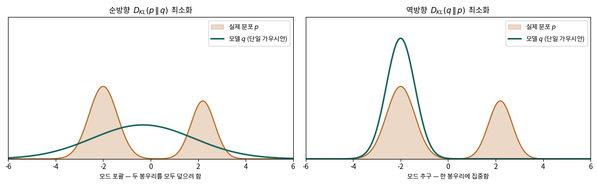
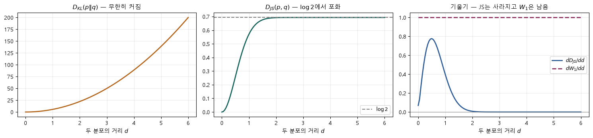

# 🎲 01 · 표현과 정보이론 — 엔트로피·교차 엔트로피·KL·JS

[딥러닝 심화](https://app.notion.com/p/3ce1b45f6f0780b9a1e7cb8dda9e1d27)
**자료 범위**: Deep2 0~2강과 실습 노트북.
**그림 기준**: 원본 이미지 또는 노트북에 저장된 실행 출력입니다. 이번 정리에서 전체 학습을 재실행한 결과는 아닙니다.

**원본**: 1강. 생성 모델을 위한 딥러닝 복습.ipynb · 1강 실습. 분포를 학습한다는 것.ipynb · 1강 실습문제 정답.ipynb
## 표현 학습과 매니폴드 가설
28×28 이미지는 784개의 숫자이지만 숫자 모양의 변화를 만드는 요인은 두께·기울기·위치 등 더 적을 수 있습니다. **표현 학습**은 원본 숫자를 과제에 도움이 되는 특징으로 바꾸는 방법까지 데이터에서 배우는 것입니다.
각 축을 10구간으로 나누면 d차원 격자는 10ᵈ칸입니다. 모든 조합을 표본으로 채우는 방식은 차원이 커질수록 어려워집니다. **매니폴드 가설**은 실제 데이터가 전체 공간보다 낮은 차원의 구조 근처에 모여 있다는 가정입니다. 모든 데이터가 완벽한 저차원 곡면 위에 있다는 보장은 아닙니다.
잠재공간에서 가까운 두 점을 보간한다고 항상 자연스러운 결과가 나오는 것도 아닙니다. 모델이 그 사이를 어떻게 학습했는지 확인해야 합니다.
## 네 지표를 하나의 식으로 연결하기
$$
H(p)=-\sum_i p_i\log p_i,\qquad H(p,q)=-\sum_i p_i\log q_i
$$
$$
D_{KL}(p\|q)=\sum_i p_i\log\frac{p_i}{q_i}=H(p,q)-H(p)
$$
p는 실제 분포, q는 모델 분포입니다. 엔트로피는 p 자체의 불확실성, 교차 엔트로피는 q로 p를 설명하는 평균 비용, KL은 그때 추가되는 비용입니다. **p를 고정했을 때** 교차 엔트로피를 줄이면 KL도 줄어듭니다.
자연로그를 쓰면 nat, 밑 2를 쓰면 bit입니다. 이산 분포의 설명과 연속 분포의 미분 엔트로피를 섞지 마세요. 미분 엔트로피는 음수가 될 수 있고 좌표 척도에도 영향을 받습니다.
## 작은 숫자로 직접 확인하기
p=(0.8,0.2), q=(0.5,0.5)이고 자연로그를 사용하면 H(p)≈0.5004, H(p,q)≈0.6931, KL(p‖q)≈0.1927입니다. 실제로 0.6931≈0.5004+0.1927입니다. 반대 방향 KL(q‖p)≈0.2231이므로 대칭이 아닙니다.
q=p이면 KL=0이고 교차 엔트로피와 엔트로피가 **같습니다**. 원본의 ‘항상 더 크다’는 표현은 ‘크거나 같다’로 읽어야 합니다.
## KL 방향을 바꾸면 왜 그림이 달라지는가

**그림 읽기**: 주황색 p는 봉우리가 두 개인 실제 분포, 초록색 q는 하나의 가우시안입니다. 왼쪽은 KL(p‖q)를 줄여 두 봉우리를 넓게 덮고, 오른쪽은 KL(q‖p)를 줄여 한 봉우리 근처에 집중한 실행입니다.
순방향은 p가 큰 영역에 q가 지나치게 작으면 큰 비용을 받습니다. 역방향은 q가 표본을 만드는 곳에 p가 작으면 큰 비용을 받습니다. **단일 가우시안으로 제한된 모델과 잘 분리된 봉우리**라는 조건에서 차이가 드러납니다. 초기값·표현력·최적화 결과에 따라 양상은 달라집니다.
<callout icon="💡" color="yellow_bg">
	**오해 바로잡기**: MLE로 학습하면 무조건 흐릿해지거나 GAN이 곧 역방향 KL을 직접 최소화한다는 뜻은 아닙니다. 이 그림은 제한된 근사 분포의 경향을 설명합니다. 고전적 GAN minimax 목적의 JS 해석과 역방향 KL 실험은 구분해야 합니다.
</callout>
## JS는 대칭이며 상한이 있다
$$
m=\frac{p+q}{2},\qquad JS(p,q)=\frac12 KL(p\|m)+\frac12 KL(q\|m)
$$
자연로그에서 0≤JS≤ln2≈0.6931입니다. JS는 두 방향 KL의 단순 평균이 아니라 **중간 분포 m에 대한 KL의 평균**입니다. √JS는 거리의 성질을 갖지만 KL은 일반적인 거리가 아닙니다.

**그림 읽기**: 같은 표준편차 0.3을 가진 두 가우시안의 평균 간격 d를 늘린 실습입니다. KL은 d²/(2σ²)로 커지고, JS는 ln2에 가까워지며 변화가 작아집니다. 가우시안의 지지집합은 전체 실수축이므로 유한한 d에서 ‘정확히 겹치지 않는다’고 말하지 않습니다.
GAN으로의 연결은 후속 예습입니다. 최적 판별기를 대입한 고전 minimax 목적은 JS로 표현되지만, 실제로 쓰는 non-saturating 생성기 손실까지 그대로 같은 식이라고 보지 않습니다. [원 논문 · Generative Adversarial Networks](https://arxiv.org/abs/1406.2661)
## 계산 코드에서 확인할 것
확률의 합이 1인지, 로그의 밑이 같은지 확인합니다. 연속 분포를 격자로 적분할 때는 간격 dx도 곱합니다. log(0)을 피하려고 ε을 더하면 원래 수학적 발산과 다른 유한한 값이 나올 수 있으므로 수치 안정화와 정확한 정의를 구분합니다.
## 스스로 설명하기

p가 양수인데 q가 0인 사건이 있으면 왜 KL(p‖q)가 문제가 될까?

	실제로 발생하는 사건을 모델이 불가능하다고 보았기 때문입니다. 이산 분포에서 해당 항은 무한대로 발산합니다. 반대 방향에서는 평균을 내는 분포와 분모가 바뀌므로 같은 값이 되지 않습니다.

---
**학습 이어가기**
이전 · [관련 노트](https://app.notion.com/p/3d81b45f6f07816eb861f55bcbec3fff)
다음 · [관련 노트](https://app.notion.com/p/3d81b45f6f0781b492ead8dfee38321f)
[딥러닝 심화](https://app.notion.com/p/3ce1b45f6f0780b9a1e7cb8dda9e1d27)
