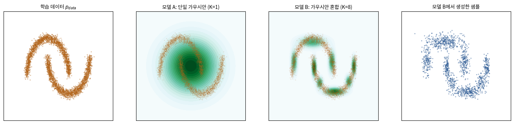
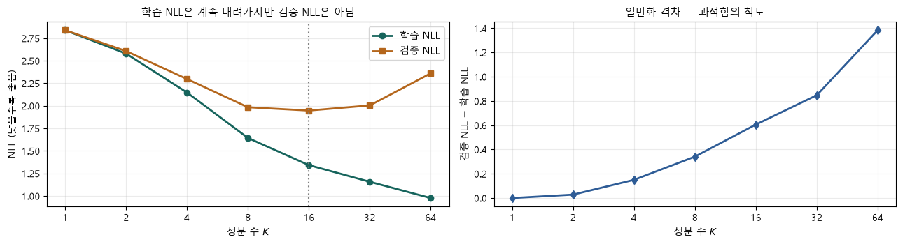

# 📊 02 · MLE·MAP와 분포 학습 — 가우시안 혼합 실습 읽기

[딥러닝 심화](https://app.notion.com/p/3ce1b45f6f0780b9a1e7cb8dda9e1d27)
**자료 범위**: Deep2 0~2강과 실습 노트북.
**그림 기준**: 원본 이미지 또는 노트북에 저장된 실행 출력입니다. 이번 정리에서 전체 학습을 재실행한 결과는 아닙니다.

**원본**: 1강. 생성 모델을 위한 딥러닝 복습.ipynb · 1강 실습. 분포를 학습한다는 것.ipynb · 1강 실습문제 정답.ipynb
## 확률과 가능도는 무엇을 고정하는가
동전 앞면 확률 θ를 고정하고 다음 결과를 생각하면 확률입니다. 앞면 3회·뒷면 1회를 이미 관측하고 θ를 바꾸어 설명력을 비교하면 가능도 θ³(1−θ)입니다. **같은 식을 보더라도 고정한 대상이 다릅니다.**
MLE는 관측 데이터를 잘 설명하는 θ를 선택합니다. 이 예에서는 θ=0.75입니다. MAP는 매개변수에 대한 사전분포까지 반영해 사후밀도가 큰 θ를 선택합니다.
## 왜 로그를 취하고 마이너스를 붙일까
$$
\hat\theta_{\mathrm{MLE}}=\arg\max_\theta\sum_{n=1}^N \log p_\theta(x_n),\qquad
\mathrm{NLL}=-\frac1N\sum_{n=1}^N \log p_\theta(x_n)
$$
독립 표본의 가능도는 곱입니다. 로그를 취하면 합이 되어 계산하기 쉽고 매우 작은 수를 계속 곱하는 문제를 줄입니다. 최댓값을 찾는 대신 음수를 붙여 최소화하면 기존 경사하강 학습 루프를 사용할 수 있습니다.
MAP는 NLL에 −log p(θ) 항을 더한 목적과 연결됩니다. 평균 손실을 쓸 때는 표본 수에 따른 계수도 맞추어야 합니다. 가우시안 사전은 L2 형태의 벌점과 연결되지만, 모든 옵티마이저의 weight decay와 무조건 같은 것은 아닙니다.
## MLE와 KL의 연결을 정확히 읽기
실제 분포 p를 고정하면 평균 음의 로그밀도는 교차 엔트로피이고, p의 엔트로피는 θ에 무관합니다. 따라서 모집단 수준에서 MLE 목적은 순방향 KL을 줄이는 것과 연결됩니다. 유한 표본 평균은 그 기대값의 추정입니다.
연속 데이터의 경험분포는 점질량이므로 연속 밀도와의 KL을 아무 조건 없이 유한한 값처럼 계산하면 안 됩니다. 실습에서 실제로 최적화하는 것은 **관측점에서의 평균 로그밀도**입니다.
## 실습 모델: 타원 하나와 작은 타원 여러 개
$$
p_\theta(x)=\sum_{k=1}^K \pi_k\,\mathcal N(x;\mu_k,\mathrm{diag}(\sigma_k^2))
$$
π는 각 성분을 선택할 확률, μ는 중심, σ는 축별 표준편차입니다. K=1은 하나의 타원형 분포이고, K=8은 여덟 성분을 섞어 굽은 모양을 더 잘 표현할 수 있습니다.

**그림 읽기**: 왼쪽은 초승달 데이터, 가운데 두 그림은 K=1과 K=8의 밀도, 오른쪽은 K=8에서 새로 뽑은 표본입니다. 학습점을 그린 그림과 모델이 생성한 점을 구분하세요. 타원 하나는 초승달 사이 빈 곳에도 많은 밀도를 주고, 여러 성분은 곡선을 따라 배치될 수 있습니다.
## GaussianMixture.log_prob의 텐서 흐름
<table header-row="true">
<tr>
<td>단계</td>
<td>shape</td>
<td>설명</td>
</tr>
<tr>
<td>입력 x</td>
<td>(N,2)</td>
<td>2차원 표본 N개</td>
</tr>
<tr>
<td>x와 mu 차이</td>
<td>(N,K,2)</td>
<td>각 표본과 각 성분 중심의 차이</td>
</tr>
<tr>
<td>comp.sum(-1)</td>
<td>(N,K)</td>
<td>대각 가우시안의 좌표별 로그밀도 합</td>
</tr>
<tr>
<td>logsumexp</td>
<td>(N,)</td>
<td>성분 가중치를 포함한 혼합 로그밀도</td>
</tr>
<tr>
<td>음수 평균</td>
<td>스칼라</td>
<td>학습에 쓰는 NLL</td>
</tr>
</table>
logit_w를 softmax로 바꾸면 π의 합이 1이 됩니다. log_sig를 exp로 바꾸면 σ가 양수가 됩니다. logsumexp는 작은 밀도를 직접 더한 뒤 로그를 취할 때 생기는 수치 문제를 줄입니다.
**샘플 생성**은 π로 성분 번호를 뽑고, 그 성분의 μ+σ×잡음을 계산하는 두 단계입니다. 점마다 가장 가까운 성분을 무조건 고르는 방식이 아닙니다.
## K를 늘리면 무조건 좋은가

**그림 읽기**: 정답 노트북에 저장된 결과에서는 K가 커질수록 훈련 NLL은 줄지만 검증 NLL은 최저점 이후 다시 올라갑니다. 오른쪽은 계산 비용 증가를 함께 보여 줍니다. 이 실습은 과적합을 보기 위해 훈련 표본 수를 줄입니다.
더 큰 모델군의 이상적인 최적값과 **고정 step으로 실제 얻은 값**은 다릅니다. 초기값·수렴 정도 때문에 K를 키웠을 때 훈련 NLL이 반드시 단조 감소하는 것은 아닙니다. 작은 σ에 성분이 표본 하나를 과도하게 따라붙는 가우시안 혼합의 특이점도 주의해야 합니다.
연속 밀도는 1보다 클 수 있으므로 NLL이 음수라는 이유만으로 오류라고 보지 않습니다. 단위·전처리가 다른 데이터의 NLL도 그대로 비교하지 않습니다.
## 실습문제 해설과 실험 순서
1. KL의 비대칭성은 q의 한 확률을 0에 가깝게 두고 확인합니다. ε 보정 크기도 기록합니다.
2. K=1,2,4,8,16,32를 같은 분할에서 비교합니다. 훈련·검증 NLL, 생성 그림, 시간과 seed를 함께 남깁니다.
3. 가우시안 평균 간격에 따른 KL·JS에서는 적분 범위와 격자 간격을 확인합니다.
**고차원으로 확장**: 고차원 분포를 학습하는 것이 원리적으로 불가능한 것은 아닙니다. 격자 채우기나 단순한 혼합 모델만으로 복잡한 구조를 표현하는 비용이 커지므로 자기회귀 분해·잠재변수·학습된 변환 같은 구조를 활용합니다.
## 스스로 설명하기

훈련 NLL만 낮아졌다면 생성 모델이 좋아졌다고 결론 내릴 수 있을까?

	아닙니다. 검증 데이터 설명력, 생성 표본의 다양성과 구조, 과적합 여부를 함께 확인합니다. 훈련 데이터를 외우거나 과도하게 뾰족한 밀도를 만들었을 가능성도 있습니다.

---
**학습 이어가기**
이전 · [관련 노트](https://app.notion.com/p/3d81b45f6f07812d908ce4419150307d)
다음 · [관련 노트](https://app.notion.com/p/3d81b45f6f0781ea8112f595e73ebb01)
[딥러닝 심화](https://app.notion.com/p/3ce1b45f6f0780b9a1e7cb8dda9e1d27)
