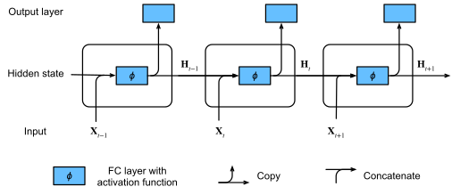
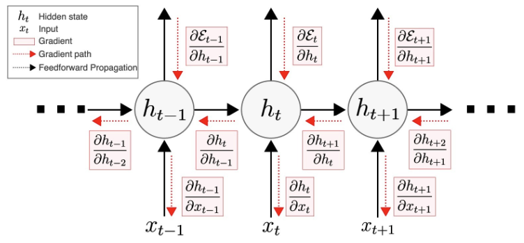
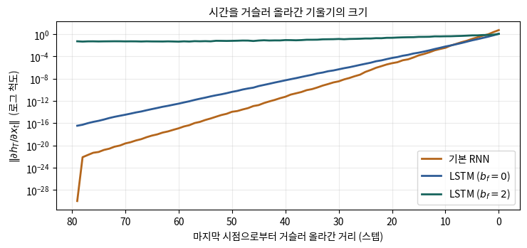
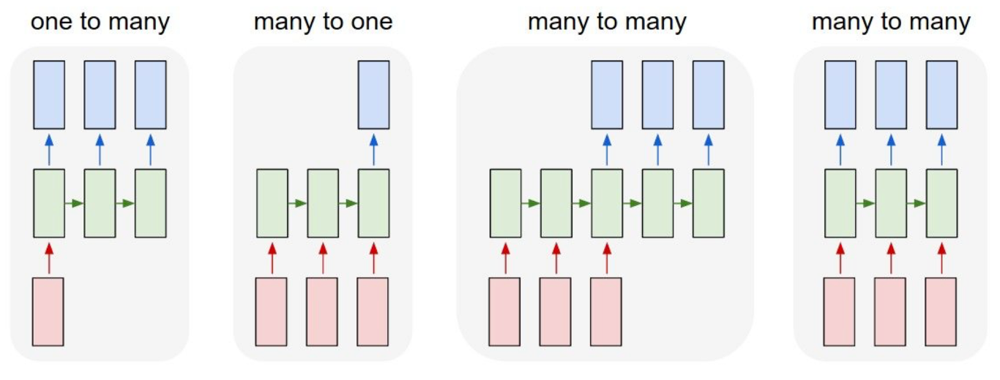

# 🔁 03 · 순차 데이터와 RNN — 은닉 상태·BPTT·기울기의 길

[딥러닝 심화](https://app.notion.com/p/3ce1b45f6f0780b9a1e7cb8dda9e1d27)
**자료 범위**: Deep2 0~2강과 실습 노트북.
**그림 기준**: 원본 이미지 또는 노트북에 저장된 실행 출력입니다. 이번 정리에서 전체 학습을 재실행한 결과는 아닙니다.

**원본**: 2강. 순차 데이터와 순환 신경망.ipynb · 2강 실습. 한글 수사 문자 단위 언어 모델.ipynb
## 순서가 의미를 만든다
문자 순서를 바꾸면 다른 단어가 되고, 같은 문자도 앞 문맥에 따라 다음 문자가 달라집니다. 순차 데이터는 길이도 달라질 수 있습니다. MLP는 고정 길이 입력을 쓰기 쉽고, CNN도 시퀀스를 처리할 수 있지만 긴 문맥을 보려면 수용영역을 설계해야 합니다. ‘CNN은 순차 데이터를 처리할 수 없다’는 뜻은 아닙니다.
Markov 모델은 현재 상태가 주어지면 더 오래된 과거와 조건부 독립이라는 가정을 둡니다. HMM은 직접 보이지 않는 상태와 관측을 구분합니다. RNN은 관측된 입력으로 연속적인 은닉 벡터를 갱신하며 과거 문맥을 요약합니다.
## 같은 셀을 시간마다 반복한다
$$
H_t=\tanh(X_tW_{xh}+H_{t-1}W_{hh}+b_h),\qquad Z_t=H_tW_{hq}+b_q
$$
Xₜ는 현재 입력, Hₜ₋₁은 이전 문맥, Hₜ는 갱신된 문맥입니다. Zₜ는 출력 logits이고 확률이 필요하면 softmax를 적용합니다. 교차 엔트로피 손실에 전달할 때는 logits를 사용합니다.

**그림 읽기**: 시간 방향으로 여러 셀이 보이지만 서로 다른 모델을 만든 것이 아닙니다. **같은 가중치를 공유**하면서 상태만 다음 시점으로 보냅니다. 상태는 데이터에 따라 달라지고 가중치는 학습으로 달라집니다.
## shape를 쓰면서 읽기
<table header-row="true">
<tr>
<td>대상</td>
<td>shape</td>
<td>의미</td>
</tr>
<tr>
<td>Xₜ</td>
<td>(B,d)</td>
<td>배치 B개의 현재 입력</td>
</tr>
<tr>
<td>Hₜ</td>
<td>(B,h)</td>
<td>배치별 은닉 상태</td>
</tr>
<tr>
<td>Wₓₕ / Wₕₕ</td>
<td>(d,h) / (h,h)</td>
<td>입력·과거 상태를 새 상태로 변환</td>
</tr>
<tr>
<td>Zₜ</td>
<td>(B,V)</td>
<td>다음 문자 V개의 점수</td>
</tr>
</table>
이 식은 행벡터 표기입니다. PyTorch Linear.weight의 저장 shape는 (출력,입력)이므로 수식의 행렬을 그대로 복사할 때 전치 여부를 확인해야 합니다.
## 손계산으로 보는 기억
스칼라 예시로 입력 가중치 1, 상태 가중치 0.5, 편향 0, 초기 h₀=0으로 둡니다. x₁=1이면 h₁=tanh(1)≈0.762입니다. x₂=0이어도 h₂=tanh(0.5×0.762)≈0.363입니다. 현재 입력이 0이어도 과거 정보가 영향을 줍니다. 다만 반복 갱신 중 정보가 약해질 수 있습니다.
## BPTT: 미래의 손실이 과거 계산을 바꾼다

**그림 읽기**: 순전파 화살표는 상태가 미래로 전달되는 경로, 역방향 화살표는 손실 기울기가 돌아오는 경로입니다. 과거 상태는 이후 여러 손실에 영향을 주므로 그 기여를 합칩니다. 시간마다 같은 가중치를 사용했기 때문에 가중치 기울기도 시간별로 누적됩니다.
$$
\frac{\partial h_T}{\partial h_t}=J_TJ_{T-1}\cdots J_{t+1}
$$
각 J는 한 시점의 상태 변화율입니다. 작은 값이 반복 곱해지면 기울기가 약해지고 큰 증폭이 누적되면 폭발할 수 있습니다.
## 기울기 소실·폭발을 구분하기

**그림 읽기**: 원본은 길이 80 시퀀스의 마지막 출력에서 역전파하고 이전 입력에 도달한 기울기를 측정합니다. 가로축은 과거로 떨어진 거리이고 세로축은 로그 척도입니다. LSTM의 망각 게이트 바이어스에 따라 감쇠 양상이 달라지는 저장 결과입니다. 모든 데이터에서 이 순위가 유지된다는 뜻은 아닙니다.
노름의 상한이 1보다 작으면 감쇠를 설명하는 충분조건을 얻을 수 있습니다. **상한이 1보다 크다는 것만으로 실제 기울기가 반드시 폭발한다고 결론 내릴 수는 없습니다.** 실제 활성화 미분과 행렬 곱의 방향도 작용합니다.
클리핑은 큰 기울기 노름을 제한하는 장치이며 작아진 기울기를 되살리는 장치는 아닙니다. loss.backward() 다음, optimizer.step() 전에 적용합니다.
## 잘라서 학습하는 두 방식을 구분하기
**독립 창 학습**: 무작위 길이 L 구간을 뽑고 매 배치 상태를 초기화합니다. 현재 Deep2의 train()이 이 방식입니다. 한 창 안에서는 모든 L시점에 대해 역전파합니다.
**상태를 이어가는 TBPTT**: 연속 구간 사이에 상태 값은 전달하고 경계에서 detach()로 과거 계산 그래프를 끊습니다. 무작위로 섞은 서로 무관한 창 사이에 상태를 그대로 넘기면 안 됩니다.
절단은 유지해야 하는 그래프의 범위와 역전파 구간을 줄입니다. 전체 시퀀스를 처리하는 총 연산이 무조건 O(T)에서 O(L)로 바뀐다는 뜻은 아닙니다.
## 입출력 구성과 확장

**그림 읽기**: 입력 하나→출력 여러 개는 캡셔닝, 여러 입력→출력 하나는 감성 분류, 같은 길이의 여러 출력은 시점별 태깅·다음 문자 학습, 길이가 다른 출력은 encoder–decoder 번역으로 연결됩니다.
다층 RNN은 깊이 방향으로 셀을 쌓고, 양방향 RNN은 앞·뒤 문맥을 결합합니다. 미래가 주어지지 않은 인과적 다음 문자 생성에 역방향 문맥을 넣으면 정보 누출입니다. 입력 전체가 이미 주어진 encoder 등에서 양방향 구조를 활용하는 것은 별개입니다.
## 스스로 설명하기

배치마다 상태를 초기화하면 그 안에서도 기억이 없을까?

	아닙니다. 창 안에서는 이전 시점의 상태가 전달됩니다. 창 바깥으로 기억을 넘기지 않을 뿐입니다. 시간 내부 상태 전달과 배치 사이 상태 전달을 구분하세요.

**보충 근거**: [D2L BPTT](https://d2l.ai/chapter_recurrent-neural-networks/bptt.html) · [RNN 기울기 문제와 클리핑 논문](https://arxiv.org/abs/1211.5063)
---
**학습 이어가기**
이전 · [관련 노트](https://app.notion.com/p/3d81b45f6f0781b492ead8dfee38321f)
다음 · [관련 노트](https://app.notion.com/p/3d81b45f6f0781fe8f1cd0c525796828)
[딥러닝 심화](https://app.notion.com/p/3ce1b45f6f0780b9a1e7cb8dda9e1d27)
