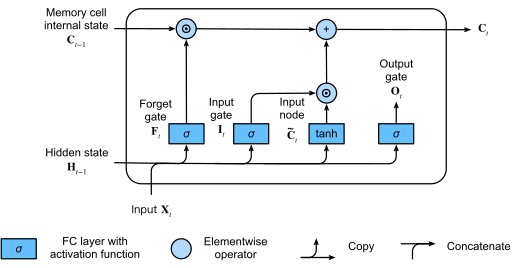
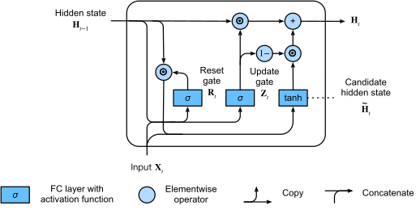

# 🚪 04 · LSTM과 GRU — 무엇을 기억하고 무엇을 바꿀까

[딥러닝 심화](https://app.notion.com/p/3ce1b45f6f0780b9a1e7cb8dda9e1d27)
**자료 범위**: Deep2 0~2강과 실습 노트북.
**그림 기준**: 원본 이미지 또는 노트북에 저장된 실행 출력입니다. 이번 정리에서 전체 학습을 재실행한 결과는 아닙니다.

**원본**: 2강. 순차 데이터와 순환 신경망.ipynb · 2강 실습. 한글 수사 문자 단위 언어 모델.ipynb
## LSTM의 핵심은 두 상태와 게이트다
기본 RNN은 하나의 은닉 상태를 매번 비선형 변환합니다. LSTM은 셀 상태 c와 은닉 상태 h를 구분하고, 기존 정보를 얼마나 남길지와 새 정보를 얼마나 쓸지를 게이트로 학습합니다.
셀 상태는 저장 공간, 은닉 상태는 현재 밖으로 내보내는 표현으로 생각하면 좋습니다. ‘장기/단기 기억’은 역할을 이해하는 비유이며 모든 유닛이 고정된 시간 척도를 갖는다는 뜻은 아닙니다.
## 갱신식을 말로 읽기
$$
c_t=f_t\odot c_{t-1}+i_t\odot g_t,\qquad
h_t=o_t\odot\tanh(c_t)
$$
f는 망각 게이트로 이전 기억의 유지 비율, i는 입력 게이트로 새 후보를 쓰는 비율, g는 tanh로 만든 후보 내용, o는 출력 게이트입니다. 게이트는 sigmoid로 0\~1 사이의 값을 만들고, ⊙는 같은 위치끼리 곱하는 연산입니다.

**그림 읽기**: 위쪽 셀 상태 경로에서 이전 상태에 망각 게이트를 곱하고, 입력 게이트를 통과한 후보를 더합니다. ‘이전 값에 무조건 덮어쓰기’가 아니라 **남길 양과 쓸 양을 따로 정하는 구조**입니다.
## 숫자 하나로 따라가기
이전 기억 c=2, f=0.9, i=0.2, 후보 g=−0.5이면 새 c=0.9×2+0.2×(−0.5)=1.7입니다. 출력 게이트 o=0.5이면 h=0.5×tanh(1.7)≈0.468입니다. 셀에 남은 값 1.7과 밖으로 나온 값 0.468은 다릅니다.
f≈1, i≈0이면 기존 기억을 오래 유지하기 쉽습니다. f≈0이면 과거 기억을 줄이고, i가 크면 후보 정보를 많이 씁니다.
## 왜 기울기가 전달되기 쉬운가
셀 상태의 직접 경로만 보면 이전 셀 상태의 계수는 f입니다. 이 경로에서 f가 1에 가까우면 정보와 기울기를 오래 전달할 여지가 생깁니다. **게이트를 고정해 보는 직접 경로의 미분**과 전체 계산 그래프의 미분을 구분해야 합니다. 게이트도 이전 은닉 상태에 의존하므로 전체에는 추가 경로가 있습니다.
망각 바이어스를 크게 두면 초기 sigmoid 값이 커져 기억을 유지하기 쉬워질 수 있습니다. 하지만 입력 항과 은닉 항도 더해지므로 모든 실제 게이트가 sigmoid(bias)와 같지는 않습니다. LSTM도 항상 먼 과거를 기억하거나 기울기 소실을 완전히 해결하지는 않습니다.
## 원본 MyLSTMCell과 식을 연결하기
W_x는 입력을 4h개 점수로, W_h는 이전 상태를 4h개 점수로 바꿉니다. 합친 결과를 i,f,g,o 순서로 네 조각으로 나눕니다. i·f·o에는 sigmoid, g에는 tanh를 적용하고 위 갱신식을 계산합니다.
직접 구현에서 W_h는 bias=False입니다. PyTorch 기본 LSTM은 입력·은닉 쪽 편향을 각각 가질 수 있으므로 매개변수 수를 맞추려면 이 차이도 확인합니다. 게이트 순서도 확인하고 비교해야 합니다.
## GRU는 기억을 하나로 합친다
$$
h_t=z_t\odot h_{t-1}+(1-z_t)\odot\tilde h_t
$$
이 노트북의 표기에서 z≈1이면 기존 상태를 유지하고, z≈0이면 후보로 교체합니다. 리셋 게이트 r은 후보를 만들 때 과거 상태의 반영 정도를 조절합니다.

**그림 읽기**: 이전 상태와 후보 상태를 z와 1−z로 섞습니다. LSTM의 별도 셀 상태·출력 게이트를 두지 않아 구조와 파라미터가 줄어듭니다. 다른 자료에서는 z의 의미를 반대로 정의할 수 있으므로 식의 계수를 확인하세요.
**구현 비교 주의**: 원본 설명은 리셋 게이트를 은닉 선형변환 전에 적용합니다. PyTorch GRU는 후보 계산에서 은닉 선형변환 뒤에 리셋 게이트를 적용하므로 단순히 같은 가중치를 넣어도 일반적으로 완전히 같은 함수가 아닙니다. [PyTorch 공식 GRU 식과 구현 차이](https://docs.pytorch.org/docs/main/generated/torch.nn.GRU.html)
## 세 모델을 공정하게 비교하기
<table header-row="true">
<tr>
<td>모델</td>
<td>상태</td>
<td>주요 게이트</td>
<td>비교 관점</td>
</tr>
<tr>
<td>RNN</td>
<td>h</td>
<td>없음</td>
<td>단순한 기준선, 긴 의존성 학습은 어려울 수 있음</td>
</tr>
<tr>
<td>LSTM</td>
<td>h,c</td>
<td>입력·망각·출력</td>
<td>기억의 유지와 새 쓰기를 분리</td>
</tr>
<tr>
<td>GRU</td>
<td>h</td>
<td>리셋·갱신</td>
<td>구조를 단순화하고 상태를 혼합</td>
</tr>
</table>
같은 은닉 크기에서 대략 셀 가중치 양이 1:4:3으로 달라집니다. 같은 은닉 크기 비교와 같은 파라미터 예산 비교는 다른 실험입니다. GRU가 언제나 빠르거나 LSTM과 같은 점수라는 보장은 없으며 데이터·커널 구현·장치에 따라 달라집니다.
일반적인 순환 계산은 시간 의존성 때문에 시점 전체를 독립적으로 계산할 수 없습니다. 배치·행렬 계산은 병렬화할 수 있으므로 ‘아무 병렬화도 불가능하다’고 표현하지 않습니다.
## 스스로 설명하기

망각 게이트만 1로 만들면 완벽한 기억 모델일까?

	아닙니다. 새 입력이 계속 더해지고 출력 게이트와 다른 경로도 작동합니다. 무엇을 보존해야 하는지 데이터에서 배워야 하며 상태 용량·최적화·문맥 길이에도 제한이 있습니다.

---
**학습 이어가기**
이전 · [관련 노트](https://app.notion.com/p/3d81b45f6f0781ea8112f595e73ebb01)
다음 · [관련 노트](https://app.notion.com/p/3d81b45f6f0781aa9f4adf09ae283690)
[딥러닝 심화](https://app.notion.com/p/3ce1b45f6f0780b9a1e7cb8dda9e1d27)
