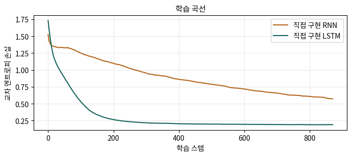

# 🔤 05 · 한글 수사 언어 모델 — 데이터부터 생성 결과까지

[딥러닝 심화](https://app.notion.com/p/3ce1b45f6f0780b9a1e7cb8dda9e1d27)
**자료 범위**: Deep2 0~2강과 실습 노트북.
**그림 기준**: 원본 이미지 또는 노트북에 저장된 실행 출력입니다. 이번 정리에서 전체 학습을 재실행한 결과는 아닙니다.

**원본**: 2강 실습. 한글 수사 문자 단위 언어 모델.ipynb
## 모델이 풀려는 문제
‘일,이,삼,…’처럼 한글로 수를 이어 쓴 문자열을 보고 **지금까지의 문자로 다음 문자 하나의 분포를 예측**합니다. 숫자를 덧셈하는 함수를 직접 넣은 것이 아니라, 문자열 패턴으로 증가·자리올림을 배울 수 있는지 보는 실험입니다.
num2kor는 숫자를 문자열로 만드는 데이터 생성 함수입니다. 10→십, 101→백일, 1234→천이백삼십사처럼 십·백·천 앞의 ‘일’을 생략합니다.
## 데이터 분할을 정확히 읽기
원본 코드의 학습 범위는 **1\~7999**, 시험 범위는 **8001\~9999**이며 8000은 두 문자열에서 빠져 있습니다. 쉼표를 포함한 어휘는 13문자입니다.
‘팔’과 ‘구’라는 문자 자체는 학습에도 있습니다. 다만 ‘팔천’·‘구천’이라는 천 단위 조합은 학습 범위에 없습니다. 따라서 시험은 새 문자 인식보다 **새 문맥 조합과 범위 밖 일반화**를 평가합니다.
vocab은 train과 test의 합집합으로 만들지만 이 자료의 문자 집합은 훈련만으로도 확보됩니다. 일반적인 데이터에서는 어휘·전처리의 결정도 훈련 데이터에서 하고 미지 토큰 처리 규칙을 둡니다.
## 입력과 정답을 한 칸 어긋나게 만들기
문자열 ‘일,이,삼’에서 입력 ‘일,이,’의 정답은 ‘,이,삼’입니다. 각 입력 위치의 바로 다음 문자가 정답이 됩니다.
get_batch는 임의 시작점에서 길이 L의 x와 한 칸 뒤로 이동한 y를 추출합니다. 배치 기본값 B=64, L=48입니다. 원본 randint 상한에서는 가능한 마지막 시작점 하나를 제외하므로, 모든 유효 창을 사용하려면 시작 인덱스 범위를 별도로 확인할 수 있습니다.
## 임베딩: 번호를 크기처럼 쓰지 않기
문자 번호 12가 3보다 의미가 네 배 크다는 뜻은 아닙니다. nn.Embedding(V,d)는 학습 가능한 (V,d) 표에서 해당 번호의 행을 꺼냅니다. one-hot(i)와 같은 표를 행렬곱해도 같은 행을 얻지만 큰 one-hot 텐서를 직접 만들 필요가 없습니다.
예를 들어 임베딩 표의 2번 행이 (0.1,−0.3)이면 문자 id=2를 넣었을 때 그 벡터를 꺼냅니다. 표의 값은 다음 문자 예측 손실을 통해 갱신됩니다.
## CharLM.forward의 텐서 흐름
<table header-row="true">
<tr>
<td>단계</td>
<td>기본 shape</td>
<td>읽는 방법</td>
</tr>
<tr>
<td>x와 y</td>
<td>(64,48)</td>
<td>각 배치에 48개 문자 id</td>
</tr>
<tr>
<td>emb(x)</td>
<td>(64,48,64)</td>
<td>문자마다 64차원 표현</td>
</tr>
<tr>
<td>한 시점 입력</td>
<td>(64,64)</td>
<td>시간축에서 t번째 벡터 선택</td>
</tr>
<tr>
<td>은닉 상태</td>
<td>(64,128)</td>
<td>128차원 문맥 요약</td>
</tr>
<tr>
<td>전체 logits</td>
<td>(64,48,13)</td>
<td>모든 시점의 다음 문자 13개 점수</td>
</tr>
<tr>
<td>손실 입력</td>
<td>(3072,13), 정답 (3072,)</td>
<td>64×48 위치를 묶어 교차 엔트로피 계산</td>
</tr>
</table>
state는 forward 내부 반복문 밖에서 만들어져 시간 사이를 이동합니다. train()은 model(x)를 상태 없이 부르므로 **새 배치에서는 상태를 초기화**합니다. collect_gates=True는 원본에서 LSTM 셀에만 지원됩니다.
## 학습 루프를 코드로 읽기
```python
logits, _ = model(x)
loss = F.cross_entropy(logits.reshape(-1, V), y.reshape(-1))
opt.zero_grad()
loss.backward()
nn.utils.clip_grad_norm_(model.parameters(), 1.0)
opt.step()
```
모든 문자 위치가 정답 신호를 줍니다. F.cross_entropy에는 softmax 전 점수를 넣고, 클리핑은 역전파 후 갱신 전에 합니다. 원본 기본 학습은 900step, 학습률 0.003입니다.

**그림 읽기**: 저장된 실행에서는 LSTM 곡선이 더 빠르게 내려갑니다. 곡선은 이동평균으로 매끈하게 표시되어 각 step의 변동과 다를 수 있습니다. 훈련 곡선만으로 새 범위에서의 일반화를 확인할 수는 없습니다.
## 저장된 결과를 직접 비교하기
<table header-row="true">
<tr>
<td>모델</td>
<td>매개변수</td>
<td>훈련 CE</td>
<td>훈련 문자 정확도</td>
<td>시험 CE</td>
<td>시험 문자 정확도</td>
</tr>
<tr>
<td>직접 RNN</td>
<td>27,213</td>
<td>0.5696</td>
<td>78.22%</td>
<td>2.1066</td>
<td>54.66%</td>
</tr>
<tr>
<td>직접 LSTM</td>
<td>101,325</td>
<td>0.1878</td>
<td>92.82%</td>
<td>1.2480</td>
<td>77.15%</td>
</tr>
</table>
수치는 **원본 셀 20의 저장 출력**입니다. evaluate는 고정 seed로 뽑은 20배치의 창에서 계산하므로 전체 시험 문자열의 모든 위치를 한 번씩 평가한 점수는 아닙니다. 점수 차이는 모델 구조 외에 파라미터 수 차이도 포함합니다.
시험 성능 격차는 기울기 감쇠만으로 확정할 수 없습니다. 범위 변화, 새 조합, 상태 초기화, 문맥 길이, 학습량도 함께 확인해야 합니다.
## 평가와 생성은 조건이 다르다
evaluate는 매 위치에 **실제 앞 문자**를 넣습니다. continue_counting은 seed를 읽은 뒤 **자기가 예측한 문자**를 다시 넣고 상태를 이어갑니다. 한번 틀린 문자가 다음 예측에 영향을 주어 생성 오류가 누적될 수 있습니다.
저장된 시험 예시에서 정답은 ‘팔천구백구십칠…’로 이어져야 하지만 LSTM은 ‘삼천구백구십칠…’을 생성했습니다. 일부 자리올림 패턴과 천의 자리 유지 능력을 나누어 평가해야 합니다.
greedy=True는 최고 점수 문자, False는 확률에 따라 문자를 뽑습니다. 같은 모델도 생성 방식에 따라 다양성과 오류 양상이 달라집니다. 문자 정확도는 전체 수열을 정확히 생성한 비율이 아닙니다.
## 과제 실험을 설계하는 방법
1. 기준 결과·환경·seed·분할을 먼저 저장합니다.
2. 은닉 크기, 문맥 길이, 망각 바이어스, 학습 step을 하나씩 바꿉니다.
3. 모델 선택은 훈련 범위 안에 별도 검증 구간을 두고 진행하고, 최종 시험 범위는 선택 후 평가합니다.
4. 문자 CE·정확도 외에 완성된 수의 정확성, 자리올림 성공, 생성 오류 예시와 시간을 기록합니다.
5. 문맥 길이를 바꾸면 같은 step에서도 처리 문자 수가 달라집니다. 동일 토큰 예산 비교인지 동일 step 비교인지 명시합니다.
## 스스로 설명하기
<details>
<summary>시험 문자 정확도가 77%이면 생성한 숫자도 77% 맞을까?</summary>
	아닙니다. 문자를 맞히는 비율과 여러 문자가 모두 맞아야 하는 숫자·수열 단위 성공률은 다릅니다. 생성에서는 자신의 오류가 다음 입력으로 되돌아가는 차이도 있습니다.
</details>
---
**학습 이어가기**
이전 · [관련 노트](https://app.notion.com/p/3d81b45f6f0781fe8f1cd0c525796828)
다음 · [관련 노트](https://app.notion.com/p/3d81b45f6f0781708d42f4858d9e39bb)
[딥러닝 심화](https://app.notion.com/p/3ce1b45f6f0780b9a1e7cb8dda9e1d27)
