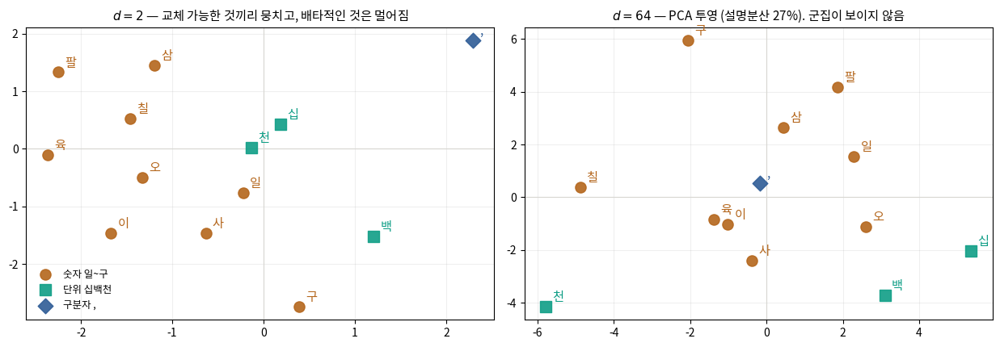
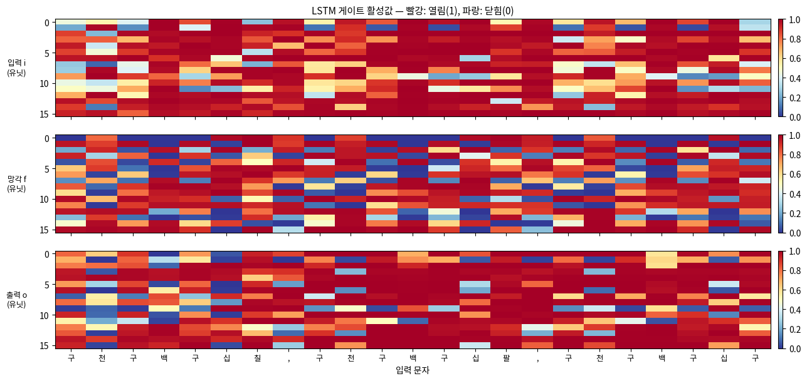

# 🔬 06 · 임베딩과 게이트를 눈으로 읽기 — 해석·오해·복습

[딥러닝 심화](https://app.notion.com/p/3ce1b45f6f0780b9a1e7cb8dda9e1d27)
**자료 범위**: Deep2 0~2강과 실습 노트북.
**그림 기준**: 원본 이미지 또는 노트북에 저장된 실행 출력입니다. 이번 정리에서 전체 학습을 재실행한 결과는 아닙니다.

**원본**: 2강 실습. 한글 수사 문자 단위 언어 모델.ipynb · 2강. 순차 데이터와 순환 신경망.ipynb
## 그림은 무엇을 보여 주는가
임베딩 그림은 **학습된 문자 표현**, 게이트 히트맵은 **특정 입력을 읽을 때 정보 통과 비율**입니다. 가중치·활성값·기울기는 서로 다르므로 그림 제목부터 확인합니다. 보기 좋은 군집이 곧 높은 예측 성능을 뜻하지는 않습니다.
## 2차원 임베딩과 64차원 투영 비교

**그림 읽기**: 왼쪽은 d=2 임베딩의 실제 두 좌표, 오른쪽은 d=64 임베딩을 PCA로 두 축에 투영한 그림입니다. 오른쪽에서 가깝거나 멀어 보이는 정도가 원래 64차원 거리와 같지는 않습니다. 설명분산이 얼마나 남았는지도 확인하세요.
원본 저장 출력에서 d=64의 숫자 내부 평균 코사인 유사도는 0.045, d=2에서는 0.395였습니다. d=2의 단위 내부 유사도는 −0.483, 숫자와 구분자는 −0.649였습니다. 이는 해당 학습 실행의 평균 통계입니다.
**보충 설명**: 작은 차원에서는 여러 문자가 공간을 공유하면서 비슷한 예측 역할이 드러날 수 있습니다. 그러나 d가 V보다 크다고 ‘직교 배치가 반드시 최적’이 되는 것은 아닙니다. 임베딩은 뒤쪽 신경망과 함께 학습하므로 차원 하나만으로 기하 구조를 결정할 수 없습니다.
서로 교체 가능한 문자가 가까워질 수 있다는 것은 유용한 관점입니다. 모든 의미가 거리로 완벽히 표현된다거나 압축해야만 의미 구조가 생긴다는 법칙으로 외우지는 마세요.
## 게이트 히트맵 읽는 순서

1. **가로축**은 입력 문자 순서입니다. 쉼표 위치를 먼저 찾습니다.
2. **세 묶음**은 입력 i·망각 f·출력 o 게이트입니다.
3. **세로축**은 선택된 유닛입니다. 각 칸은 특정 문자 시점의 특정 유닛 게이트 값입니다.
4. **색**은 0\~1 통과 비율입니다. 빨강은 1에 가깝고 파랑은 0에 가깝습니다.
원본 코드는 전체 은닉 유닛 중 **망각 게이트가 시간에 따라 많이 변한 16개**를 고릅니다. 전체 128개를 모두 보여 주거나 게이트 평균을 그림으로 만든 것이 아닙니다. 세 묶음은 같은 선택 유닛을 사용합니다.
## 평균값과 개별 유닛을 구분하기
원본 저장 출력의 평균은 입력 0.742, 망각 0.724, 출력 0.751입니다. 쉼표 위치에서의 평균은 각각 0.846, 0.621, 0.767입니다.
쉼표에서 평균이 달라진다는 것은 문자 경계에 반응하는 패턴이 있다는 **관찰**입니다. ‘이 유닛이 천의 자리만 기억한다’는 기능을 확정하려면 추가 검증이 필요합니다.
망각 게이트가 1에 가까운 유닛은 이전 셀 상태를 직접 경로에서 잘 보존할 여지가 있습니다. 무엇을 보존하는지까지 색만으로 알 수는 없습니다. 입력 게이트와 실제 셀 상태도 함께 봅니다.
## 해석을 확인하는 추가 실험
같은 접미부에 천 단위만 바꾼 문장을 입력해 상태가 어떻게 변하는지 비교합니다. 특정 유닛을 0으로 만들었을 때 천 단위 오류만 늘어나는지도 볼 수 있습니다. 여러 seed와 여러 문장에서 반복해 패턴이 안정적인지 확인합니다.
이 실험들은 **추가 검증 제안**이며 현재 노트북에서 이미 수행된 성과로 기록하지 않습니다.
## 원본을 읽을 때 바로잡을 표현
<table header-row="true">
<tr>
<td>단정하기 쉬운 표현</td>
<td>정확한 해석</td>
</tr>
<tr>
<td>생성 모델은 정답이 없다</td>
<td>별도 라벨 없이도 다음 문자·노이즈 같은 학습 목표를 만들 수 있음</td>
</tr>
<tr>
<td>교차 엔트로피는 항상 엔트로피보다 크다</td>
<td>크거나 같으며 p=q이면 같음</td>
</tr>
<tr>
<td>역방향 KL은 GAN 그 자체다</td>
<td>KL 방향 실험과 GAN 목적의 JS 해석을 구분</td>
</tr>
<tr>
<td>고차원 p(x)는 학습 불가능하다</td>
<td>단순 격자·제한된 모델의 비용이 커지며 구조를 활용해 학습함</td>
</tr>
<tr>
<td>노름 상한이 1보다 크면 반드시 폭발한다</td>
<td>상한만으로 폭발을 보장할 수 없음</td>
</tr>
<tr>
<td>현재 실습은 배치 사이 stateful TBPTT다</td>
<td>train()은 매 창 상태 초기화, 생성 함수는 상태 전달</td>
</tr>
<tr>
<td>LSTM 직접 셀 경로 미분이 전체 미분이다</td>
<td>게이트를 통한 추가 의존 경로가 있음</td>
</tr>
<tr>
<td>게이트 색만으로 기억 내용을 알 수 있다</td>
<td>관찰에 근거한 가설이며 추가 실험이 필요함</td>
</tr>
</table>
## 빠진 그림과 중복 이미지 처리
실습에서 참조하는 img/2026-embedding.svg와 img/2026-charlm-forward.svg는 제공 폴더에 없습니다. 해당 설명은 실제 저장된 임베딩 그래프와 05페이지의 텐서 모양 표·작은 계산 예시로 보완했습니다.
img와 img/img에는 같은 이름의 강의 그림이 중복되어 있어 필요한 문맥에 한 번씩 골라 배치했습니다. 그림의 의미를 유지하고 전체 이미지를 나열하는 대신 각 개념 바로 아래에 배치했습니다.
## 복습 질문과 답

정수 id → 임베딩 → RNN → logits의 각 역할은?

	id는 문자를 식별하고, 임베딩은 문자를 학습 가능한 벡터로 바꾸고, RNN은 문맥을 반영하고, logits는 다음 문자 후보의 점수를 나타냅니다.

훈련 손실이 낮고 시험 생성이 틀리는 이유는?

	훈련 범위와 시험 범위가 다르고, 생성에서는 이전 예측 오류가 입력으로 돌아갑니다. 파라미터 용량·문맥 길이·학습량도 확인해야 합니다. 낮은 훈련 손실만으로 규칙 일반화를 보장하지 않습니다.

다음 강의 Attention과는 어떻게 이어지는가?

	RNN은 과거를 상태에 요약합니다. Attention은 필요한 입력 위치를 참조하도록 학습하는 방식으로 연결됩니다. 참조 경로가 생긴다고 모든 규칙 일반화 문제가 자동으로 해결되는 것은 아닙니다. 상세 내용은 후속 강의 자료가 확보되면 확장합니다.

---
**학습 이어가기**
이전 · [관련 노트](https://app.notion.com/p/3d81b45f6f0781aa9f4adf09ae283690)
[딥러닝 심화](https://app.notion.com/p/3ce1b45f6f0780b9a1e7cb8dda9e1d27)
